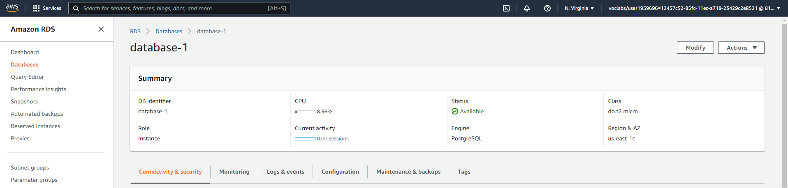
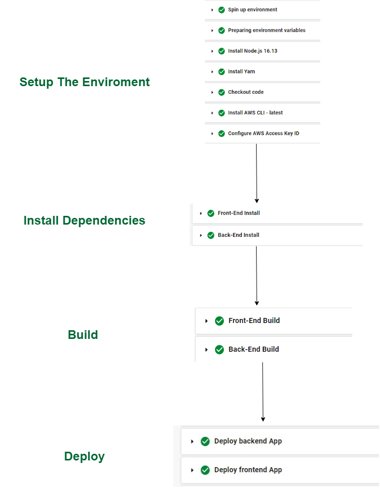
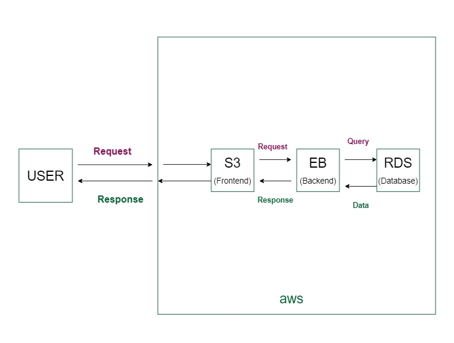

# Udagram

This project is part of the Udacity Advancded web developement. 
The purpose of this project is to host it on aws cloud service.
## Tools and technologies used in the project

Node js

Express js

TypeScript

Jasmine and Super set for testing

Angular


## Live Project

http://udagram123.s3-website-us-east-1.amazonaws.com


## Backend Scripts(udagram-api)

After navigating to `udagram-api` directory, you can use the the following scripts:

```bash
npm start        # Starts the server
npm run build    # Builds the api
npm run dev      # Run in developement enviromen
npm run test     # run unit tests
npm run prod   # Run in production enviroment
npm run deploy   # deploy to elasticbeanstack 

```

## Frontend Scripts(udagram-frontend)

```bash
npm start        # Starts the server
npm run build    # Builds the api
npm run dev      # Run in developement enviromen
npm run test     # run unit tests
```

## Enviromental Variables Set up
Bellow are the environmental variables that needs to be set in a `.env` file. 
```bash

PORT
POSTGRES_HOST
POSTGRES_DB
POSTGRES_PORT
POSTGRES_USERNAME
POSTGRES_PASSWORD
AWS_BUCKET
AWS_PROFILE
AWS_REGION
JWT_SECRET
URL
AWS_ACCESS_KEY_ID
AWS_SECRET_ACCESS_KEY	
AWS_SESSION_TOKEN	
```


## Configuration Screenshots

### Elastic Beanstalk Environment


### FrontEnd S3 Bucket


### FrontEnd S3 Bucket Static Web hosting


### PostgreSQL RDS database



### CircleCI Pipeline


### CircleCI Pipeline secrets


Pipeline Diagram


### Architecture


