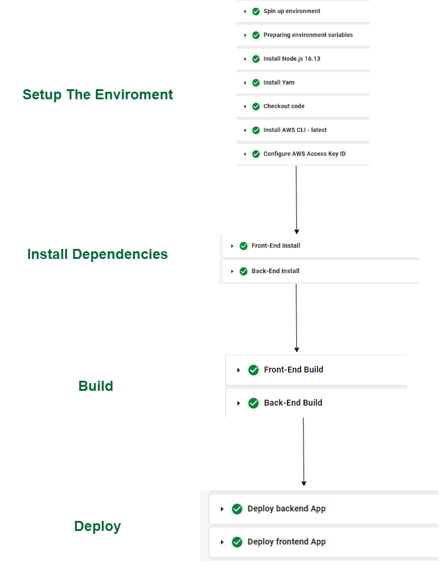

# Pipeline Process

The pipeline is setup and connected with this GitHub repository in CircleCI.

## Pipeline commands order

1. Setup the enviroment, install node.js Then checkout the code.
2. install aws cli and eb cli
3. Configure aws access key id
4. FrontEnd & BackEnd install
5. FrontEnd & BackEnd build
6. FrontEnd & BackEnd deploy

## Schema

